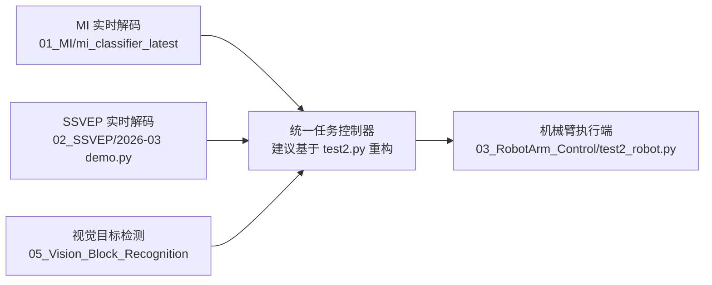
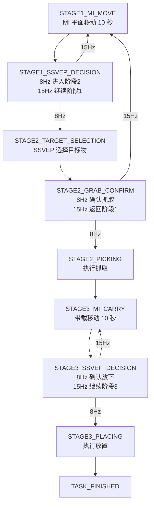

# 系统架构与主线开发图

本文件用于说明当前 `brain_code` 中最合理的系统架构，以及后续建议采用的主线开发方式。

## 1. 当前最合理的系统结构

当前最合理的理解方式是：

- MI 负责提供方向类意图
- SSVEP 负责提供选择与确认类意图
- 视觉负责提供目标检测和目标位置
- 统一任务控制器负责状态切换
- 机械臂执行端负责真正动作执行

## 2. 当前应采用的主线文件

### 2.1 统一任务控制器基底

- `05_Vision_Block_Recognition/2026-03_yolo_camera_detection/computer/test2.py`

原因：

- 已经有状态骨架
- 已经有目标框和刺激显示
- 已经能发送机械臂命令
- 最接近最终任务流

### 2.2 机械臂动作执行端

- `03_RobotArm_Control/2026-03_jetmax_execution_server/test2_robot.py`

原因：

- 已经定义并实现 `MOVE`、`PICK`、`PLACE`
- 是当前最明确的执行端协议实现

### 2.3 SSVEP 主线

- `02_SSVEP/2026-03_realtime_ui_and_online_decoder/SSVEP/demo.py`

原因：

- 已具备实时判别与平滑输出
- 距离“可接任务状态机”已经很近

### 2.4 MI 主线

- `01_MI/mi_classifier_latest/code/realtime/mi_realtime_infer_only.py`
- `01_MI/mi_classifier_latest/code/shared/src/realtime_mi.py`

原因：

- 已具备稳定输出和拒识机制
- 已具备实时推理主链路
- 当前主要问题在模型效果，不在代码结构

## 3. 建议采用的任务状态机

后续建议的正式状态机如下：

## 4. 当前代码与目标状态机的对应关系

### 已有但还不完整的部分

- `STATE_SEARCH`
- `STATE_PICKING`
- `STATE_CARRY`
- `STATE_PLACING`

这些状态已经在 `test2.py` 中存在，但目前还是偏仿真逻辑：

- 移动是鼠标输入
- 选择是键盘输入
- 放置是空格键输入
- 抓取后进入搬运是固定延时，不是真实决策

### 后续要做的事

要从当前骨架变成正式系统，需要把这些仿真输入替换掉：

1. 鼠标移动替换成 MI 输出
2. 键盘目标选择替换成真实 SSVEP 输出
3. 空格放置替换成真实 SSVEP 决策
4. 固定延时切换替换成明确状态机逻辑

## 5. 当前最优开发顺序

### 第一步

先把 `test2.py` 重构成统一任务控制器。

### 第二步

把机械臂协议完全统一到 `test2_robot.py`。

### 第三步

先把 SSVEP 接进总控，完成真实的“选择”和“确认”逻辑。

### 第四步

等状态机和联调稳定后，再补强 MI，并替换鼠标移动。

## 6. 一句话理解当前仓库

当前仓库不是“没有系统”，而是“已经有多个可复用子系统，但还缺统一任务控制层”。  
后续开发最重要的工作，是把这些子系统真正串成一条主线。
