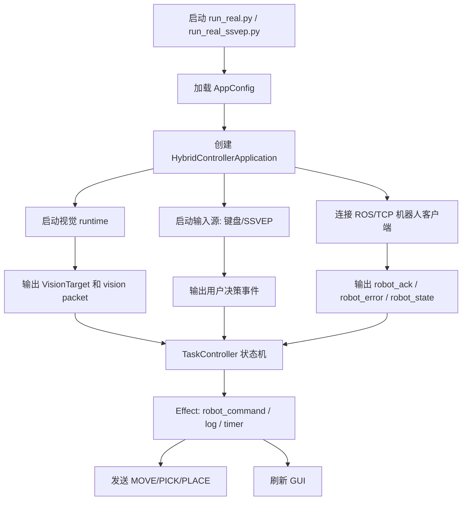
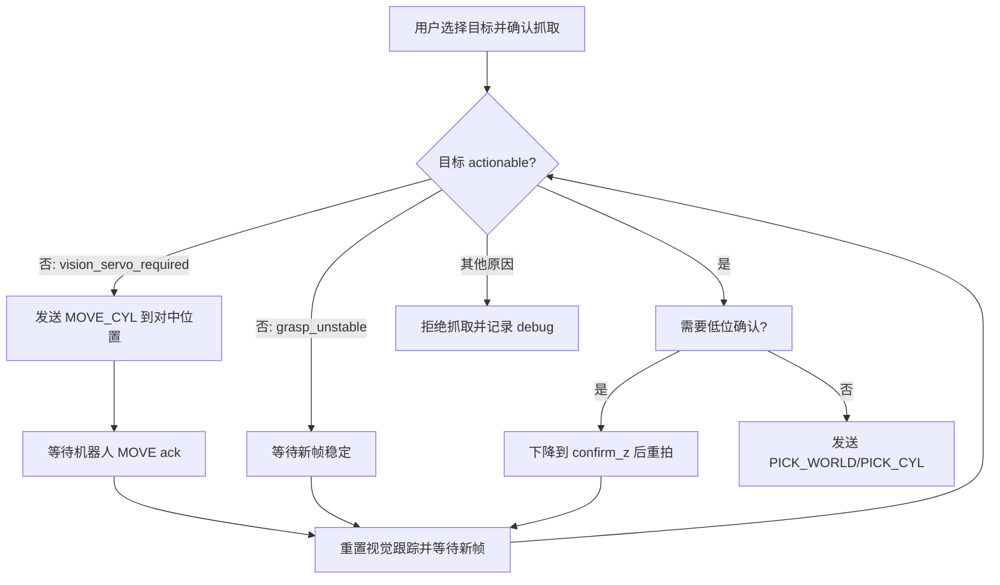

# Hybrid Controller 机械臂视觉抓取主程序

Current default: launch real-robot work with `hybrid_controller/run_real.py`. The main program runs in `operator_keyboard` mode, so keyboard/operator input replaces MI and SSVEP recognition while robot connection, ROS transport, camera vision, MOVE/PICK/PLACE, tuning, logs, and safety gates stay active. `run_real_ssvep.py` is kept only as an experimental/manual BCI path.

`hybrid_controller` 是当前 JetMax 机械臂联调主线，负责把电脑端 GUI、机械臂 ROS runtime、摄像头视觉检测、SSVEP/键盘决策、视觉闭环对中、吸盘抓取和放置流程串起来。

当前推荐链路是：

```text
电脑端 PyQt GUI
  -> rosbridge 9091
  -> JetMax ROS service/runtime node
  -> JetMax 机械臂 + 吸盘 + 末端旋转舵机

机械臂摄像头
  -> web_video_server 8080
  -> 电脑端视觉检测
  -> 目标坐标/闭环对中
  -> PICK_WORLD / PICK_CYL
```

TCP `8888` 仍保留为兼容和诊断路径，但真机主流程默认走 ROS。

---

## 1. 目录结构

```text
hybrid_controller/
  app.py                         # 电脑端 GUI 主程序和运行时协调器
  run_real.py                    # 真机 GUI 入口，键盘/模拟决策
  run_real_ssvep.py              # 真机 GUI 入口，SSVEP 决策
  config.py                      # 主配置，视觉、机器人、SSVEP、调参入口
  app_robot_commands.py          # PICK/MOVE 命令构造、偏置改写
  cylindrical.py                 # 笛卡尔坐标和圆柱坐标转换

  controller/
    state_machine.py             # 任务阶段枚举
    task_controller.py           # 任务事件状态机
    context.py                   # 当前任务上下文
    events.py                    # Event / Effect 定义

  vision/
    runtime.py                   # 摄像头读取、YOLO 推理、目标包输出
    processing.py                # mask/bbox -> grasp_pixel/角度/视觉包
    calibration_profile.py       # 视觉标定 profile、去畸变、残差映射
    target_resolver.py           # 视觉 delta -> robot base PICK 点

  robot/
    run_hybrid_controller_ros_runtime.sh
    runtime/                     # 机械臂执行核心，TCP 兼容网关
    ros_pkg/hybrid_controller_ros/
    tools/                       # 远程启动、ROS service 探针

  tools/
    calibrate_suction_target_pixel.py  # 标定吸盘投影像素
    vision_calibration_profile.py      # 生成视觉标定 profile/热力图

  dataset/
    vision_calibration/current_profile.json
    robot_pick_tuning/current_pick_tuning.json
    ssvep_profiles/current_fbcca_profile.json

  tests/
```

---

## 2. 运行环境

### 2.1 Python 解释器

电脑端推荐使用仓库 `.venv`，或者设置 `BRAIN_PYTHON_EXE` 指向你的统一解释器。

如果使用当前机器上的 conda 环境，例如：

```powershell
$env:BRAIN_PYTHON_EXE = "C:\Users\P1233\miniconda3\envs\brain-vision\python.exe"
```

然后运行入口脚本：

```powershell
& $env:BRAIN_PYTHON_EXE .\hybrid_controller\run_real.py
```

`run_real.py` 和 `run_real_ssvep.py` 会检查解释器。如果没有 `.venv`，又没有设置 `BRAIN_PYTHON_EXE`，可能会因为解释器不匹配而退出。

### 2.2 网络和端口

机械臂 WiFi 默认地址通常是：

```text
192.168.149.1
```

常用端口：

```text
9091  rosbridge，电脑端 GUI 调 ROS service/订阅状态
8080  web_video_server，电脑端读取摄像头画面
8888  TCP legacy runtime，保留兼容
```

---

## 3. 一键启动流程

### 3.1 推荐启动方式

先连接机械臂 WiFi，然后在 `brain_code` 仓库根目录运行：

```powershell
$env:BRAIN_PYTHON_EXE = "C:\Users\P1233\miniconda3\envs\brain-vision\python.exe"
& $env:BRAIN_PYTHON_EXE .\hybrid_controller\run_real.py
```

如果使用 SSVEP 决策：

```powershell
$env:BRAIN_PYTHON_EXE = "C:\Users\P1233\miniconda3\envs\brain-vision\python.exe"
& $env:BRAIN_PYTHON_EXE .\hybrid_controller\run_real_ssvep.py
```

这两个入口默认参数主要是：

```text
robot_transport = ros
robot_host = 192.168.149.1
rosbridge_port = 9091
vision_mode = robot_camera_detection
vision_mapping_mode = delta_servo
move_source = sim
decision_source = sim 或 ssvep
```

### 3.2 机械臂端 runtime 自动启动

电脑端 GUI 会尝试检查 `192.168.149.1:9091`。如果 ROS runtime 不可用，并且配置允许自动启动，程序会通过 SSH 尝试启动机械臂端 runtime。

自动启动依赖：

```text
机械臂和电脑在同一网络
192.168.149.1 可达
SSH 账号密码仍为 hiwonder / hiwonder
机械臂端存在 /home/hiwonder/brain_code
Windows 防火墙没有拦截 Python 发起连接
```

也可以手动远程启动：

```powershell
& $env:BRAIN_PYTHON_EXE .\hybrid_controller\robot\tools\jetmax_start_ros_runtime.py `
  --host 192.168.149.1 `
  --user hiwonder `
  --password hiwonder `
  --remote-root /home/hiwonder/brain_code
```

### 3.3 机械臂端手动启动

如果自动启动失败，可以 SSH 到 JetMax 后执行：

```bash
cd ~/brain_code/hybrid_controller/robot
python3 -m pip install -r requirements-jetmax-robot-python.txt
bash run_hybrid_controller_ros_runtime.sh
```

脚本会做：

```text
1. 拷贝/编译 ROS package 到 ~/catkin_ws
2. 启动 rosbridge websocket，默认 9091
3. 启动 web_video_server，默认 8080
4. 启动 hybrid_controller_runtime_node.py
```

---

## 4. 总体程序流程

主程序是事件驱动的。输入来自键盘、SSVEP、视觉、机器人状态和定时器；输出是 GUI 更新、机器人命令、日志和调试包。



核心文件：

```text
app.py
  负责启动 Qt、视觉线程、机器人客户端、SSVEP、远程启动、debug bundle。

controller/task_controller.py
  负责任务阶段切换，不直接操作硬件，只产出 Effect。

robot/runtime/robot_runtime.py
  机械臂端执行 MOVE/PICK/PLACE，控制吸盘和末端旋转。

vision/runtime.py
  读取摄像头、运行检测、维护目标槽位、输出视觉包。
```

---

## 5. 任务状态机流程

任务状态定义在 `controller/state_machine.py`：

```text
IDLE
S1_MI_MOVE
S1_DECISION
S2_TARGET_SELECT
S2_GRAB_CONFIRM
S2_PICKING
S3_MI_CARRY
S3_DECISION
S3_PLACING
FINISHED
ERROR
```

典型流程：

```text
IDLE
  按 N 或开始任务

S1_MI_MOVE
  用户控制机械臂移动到合适区域。
  当前 move_source=sim 时，W/A/S/D 或方向键产生移动事件。

S1_DECISION
  用户确认是否进入目标选择。
  Enter/C 确认，Esc/X 返回移动。

S2_TARGET_SELECT
  程序冻结当前视觉目标列表，用户选择 1/2/3/4。

S2_GRAB_CONFIRM
  已选中目标，等待用户确认抓取。
  如果目标不可抓取，例如未标定、未对中、残差过高，则拒绝。

S2_PICKING
  下发 PICK_WORLD 或 PICK_CYL。
  等待机器人返回 PICK_DONE。

S3_MI_CARRY
  抓取成功后，用户带着物体移动到放置区。

S3_DECISION
  用户确认是否放下。

S3_PLACING
  下发 PLACE。
  机械臂先下降，再松吸盘，再抬起。

FINISHED
  一轮任务完成。
```

---

## 6. 键盘和 SSVEP 输入

### 6.1 键盘调试

常用按键：

```text
N          开始任务
W / Up     半径增大，机械臂前伸
S / Down   半径减小，机械臂后收
A / Left   theta 减小，向左转
D / Right  theta 增大，向右转
1/2/3/4    选择视觉目标槽位
Enter / C  确认
Esc / X    取消
R          重置任务状态机
```

注意：

```text
GUI 窗口必须有焦点。
PICKING / PLACING / ERROR 期间移动输入会被门控。
机器人还没 ack 上一个 MOVE 时，新 MOVE 会被忽略。
```

### 6.2 SSVEP

`run_real_ssvep.py` 使用 SSVEP 作为决策源。SSVEP 相关 profile 默认在：

```text
dataset/ssvep_profiles/current_fbcca_profile.json
```

GUI 中有两个独立开关：

```text
SSVEP 刺激开关
  控制画面闪烁。

SSVEP 识别开关
  控制在线识别线程。
```

抓取完成后，如果刺激还开着，程序会自动关闭刺激，避免抓取后继续闪烁影响下一阶段。

---

## 7. 机器人通信流程

### 7.1 ROS 主链

电脑端通过 `adapters/rosbridge_client.py` 调用 ROS service。机械臂端由 `robot/ros_pkg/hybrid_controller_ros/scripts/hybrid_controller_runtime_node.py` 接收 service 请求，再转给 runtime executor。

常见 service/命令语义：

```text
MOVE_CYL theta radius z
  移动到圆柱坐标。

MOVE_CYL_AUTO theta radius
  移动到圆柱坐标，z 由自动高度曲线决定。

PICK_WORLD x y [sucker_angle]
  以机械臂基座世界坐标抓取，可选末端吸盘旋转角。

PICK_CYL theta radius [sucker_angle]
  以圆柱坐标抓取，可选末端吸盘旋转角。

SET_SUCKER_ROTATION angle [duration]
  单独旋转吸盘末端。

PLACE
  放置当前携带物体。

ABORT / RESET / SUCKER_OFF
  安全控制和恢复。
```

### 7.2 TCP 兼容链

TCP runtime 保留在 `robot/runtime` 内，主要用于旧流程或诊断。当前 GUI 真机主线不优先使用 TCP。

---

## 8. 视觉检测和抓取坐标流程

当前默认模式：

```text
vision_mode = robot_camera_detection
vision_mapping_mode = delta_servo
pick_tool_offset_source = target_pixel
```

### 8.1 从摄像头到候选目标

流程由 `vision/runtime.py` 里的 `VisionRuntime` 负责调度，由 `vision/processing.py` 负责检测、几何计算和坐标映射：

```text
1. 从 web_video_server 读取机械臂摄像头画面。
2. YOLO 推理，得到 boxes/masks。
3. 如果 YOLO 没有可用目标，可以启用颜色无关 fallback。
4. mask 或 bbox 转成 DetectionCandidate。
5. 根据 ROI、面积、置信度、形状质量筛选。
6. 更新 SlotState，稳定跟踪 1 到 4 个目标槽位。
```

视觉包会包含：

```text
pixel_center
grasp_pixel
bbox
polygon
oriented_bbox
grasp_quality
grasp_angle_deg
grasp_angle_quality
grasp_stable_frames
grasp_stability_px
camera_to_world_raw
undistorted_pixel
alignment_target_pixel
estimated_xy_error_mm
servo_required
actionable
invalid_reason
```

### 8.2 抓取点如何确定

当前逻辑：

```text
mask -> largest component -> contour -> minAreaRect
```

默认吸取点是 `minAreaRect` 的矩形中心，这比直接使用整块 mask 质心更稳定。顶面启发式只有在质量足够高、偏移不离谱时才会覆盖矩形中心。

角度来自 `minAreaRect` 的主方向，并归一化到 `[-45, 45]`。颜色只用于辅助分割，不用于决定抓取角度。

稳定策略：

```text
grasp_pixel 使用最近 3 到 5 帧中位数
grasp_angle_deg 使用最近 3 到 5 帧角度中位数
如果点跳变太大，历史清空
如果角度跳变太大，角度质量降低或等待稳定
```

### 8.3 摄像头中心不等于吸盘中心

这是本项目最关键的点。

摄像头随臂移动，吸盘在摄像头后方。程序不应该简单把木块移动到图像中心，而应该移动到“吸盘投影像素”：

```text
servo.target_pixel
```

这个值保存在视觉标定 profile 中，表示：

```text
当吸盘正对木块时，木块在摄像头画面中应该出现的位置。
```

默认：

```text
pick_tool_offset_source = target_pixel
```

也就是说，程序默认使用 `servo.target_pixel` 做吸盘偏置补偿，不再叠加 `pick_cyl_radius_bias_mm`。旧的 `r_bias` 调试方式仍保留，但必须显式切换：

```powershell
--pick-tool-offset-source command_bias
```

---

## 9. 视觉标定 profile

默认 profile：

```text
dataset/vision_calibration/current_profile.json
```

profile 主要字段：

```json
{
  "profile_id": "eye-in-hand-current",
  "created_at": "...",
  "image_size": [640, 480],
  "K": [[...]],
  "D": [...],
  "pixel_to_delta": {
    "model": "affine",
    "matrix": [[...], [...]]
  },
  "residual_grid": {
    "model": "grid",
    "x_values": [...],
    "y_values": [...],
    "correction_dx_mm": [[...]],
    "correction_dy_mm": [[...]],
    "error_mm": [[...]]
  },
  "valid_workspace": {
    "undistorted_pixel_polygon": [[...], [...], [...]]
  },
  "residual": {
    "median_error_mm": 2.0,
    "p95_error_mm": 5.0,
    "max_error_mm": 6.0
  },
  "limits": {
    "max_allowed_error_mm": 6.0
  },
  "servo": {
    "target_pixel": [320.0, 240.0],
    "center_tolerance_px": 8.0,
    "gain": 0.8,
    "max_attempts": 5
  }
}
```

### 9.1 坐标映射逻辑

`VisionCalibrationProfile.map_pixel_to_delta()` 的顺序：

```text
1. 检查 frame_size 是否和 profile.image_size 一致。
2. 如果有 K/D，执行 cv2.undistortPoints。
3. 检查点是否在 valid_workspace 内。
4. 用 affine 或 homography 把像素映射成 delta_xy_mm。
5. 叠加 residual_grid 的局部补偿。
6. 如果有 target_pixel，则同时映射 target_pixel，并输出二者差值。
7. 输出 estimated_xy_error_mm。
```

如果出现这些情况，目标会被拒绝：

```text
calibration_profile_unavailable
calibration_profile_image_size_mismatch
calibration_profile_point_outside_valid_workspace
calibration_profile_residual_grid_out_of_bounds
vision_mapping_error_high
alignment_target_unavailable
```

### 9.2 为什么要拒绝而不是盲抓

机械臂视觉误差通常在画面边缘变大。现在程序宁愿拒绝，也不把高残差点转成真实抓取命令。这样失败表现是“不可抓取/未收敛”，而不是机械臂乱抓。

---

## 10. 闭环视觉抓取流程

闭环逻辑在 `app.py` 中，围绕 `vision_servo_required` 和 `_vision_servo_pick` 状态运行。



关键参数：

```text
vision_pick_search_z_mm = 190
  搜索高度，视野更大。

vision_pick_confirm_z_mm = 130
  最终确认高度。

vision_servo_move_gain = 0.8
  粗对中增益。

vision_servo_fine_move_gain = 0.4
  接近目标时的小步增益。

vision_servo_center_tolerance_px = 8
  profile 建议中心容差。

vision_servo_action_tolerance_px = 8
  允许最终抓取的动作容差。

vision_servo_max_attempts = 5
  最大闭环移动次数。

vision_action_max_error_mm = 6
  允许自动抓取的最大视觉估计误差。
```

最终只有满足这些条件才会下发抓取：

```text
目标 valid
grasp_quality 达标
profile 可用
frame_size 匹配
estimated_xy_error_mm <= 阈值
grasp_pixel 已经靠近 servo.target_pixel
grasp_pixel 多帧稳定
目标在机械臂工作区内
机器人状态允许抓取
```

---

## 11. 吸盘、末端旋转和放置顺序

### 11.1 吸盘开关

吸盘开关由机械臂端 runtime 控制：

```text
PICK 阶段打开吸盘
PLACE 阶段释放吸盘
SUCKER_OFF 强制关闭吸盘
```

### 11.2 末端旋转

如果机械臂端存在 `hiwonder.pwm_servo1`，runtime 会支持吸盘末端旋转：

```text
SET_SUCKER_ROTATION angle [duration]
PICK_WORLD x y [angle]
PICK_CYL theta radius [angle]
```

角度来自视觉的 `grasp_angle_deg`，并经过：

```text
sucker_rotation_offset_deg
sucker_rotation_invert
sucker_rotation_min_deg / max_deg
```

抓取顺序：

```text
1. 移动到抓取点上方安全高度
2. 设置吸盘旋转角
3. 等待舵机稳定
4. 开吸盘
5. 下探
6. 抬起
```

放置顺序：

```text
1. 移动到放置点上方
2. 下降到放置高度
3. 松开吸盘
4. 短暂停留
5. 抬起
```

这保证不会在空中提前松开物块。

---

## 12. 标定流程

视觉抓取精度主要依赖标定。不要长期依赖手调 `r_bias`。

### 12.1 标定吸盘投影像素

目标：得到 `servo.target_pixel`。

物理步骤：

```text
1. 关闭吸盘，避免噪声和误吸。
2. 手动移动机械臂，让吸盘正对小木块中心。
3. 确认此时摄像头画面中能看到木块。
4. 运行工具，把木块当前像素写入 profile 的 servo.target_pixel。
```

自动检测多颜色木块：

```powershell
& $env:BRAIN_PYTHON_EXE .\hybrid_controller\tools\calibrate_suction_target_pixel.py `
  --host 192.168.149.1 `
  --profile .\hybrid_controller\dataset\vision_calibration\current_profile.json
```

如果自动检测不准，可以手动给像素：

```powershell
& $env:BRAIN_PYTHON_EXE .\hybrid_controller\tools\calibrate_suction_target_pixel.py `
  --manual-pixel 352,238 `
  --profile .\hybrid_controller\dataset\vision_calibration\current_profile.json
```

### 12.2 生成全视野标定 profile

输入 CSV 至少包含：

```csv
pixel_x,pixel_y,delta_x_mm,delta_y_mm
349,234,0,0
383,236,10,0
...
```

推荐采集 7x7 工作区样本，并留出 20% 验证：

```powershell
& $env:BRAIN_PYTHON_EXE .\hybrid_controller\tools\vision_calibration_profile.py `
  --samples-csv .\hybrid_controller\dataset\vision_calibration\samples.csv `
  --output .\hybrid_controller\dataset\vision_calibration\current_profile.json `
  --profile-id eye-in-hand-current `
  --model homography `
  --residual-model grid `
  --grid-size 7 `
  --target-pixel 352,238 `
  --image-width 640 `
  --image-height 480 `
  --max-allowed-error-mm 6
```

输出：

```text
current_profile.json
current_profile_validation.csv
current_profile_heatmap.png
```

验收目标：

```text
验证集 median <= 3 mm
验证集 p95 <= 6 mm
边缘区域不能靠猜，误差超限就禁止自动抓取
```

---

## 13. 抓取调试建议

### 13.1 推荐调试顺序

```text
1. 只测试机械臂移动：MOVE_CYL / MOVE_CYL_AUTO。
2. 测试吸盘开关和 PLACE 顺序。
3. 关闭吸盘，测试 SET_SUCKER_ROTATION -30/0/30。
4. 标定 servo.target_pixel。
5. 用左/中/右三个位置测试视觉对中，不立刻抓。
6. 确认对中稳定后，再启用抓取。
7. 最后做 5x5 工作区验收。
```

### 13.2 ROS 探针

状态检查：

```powershell
& $env:BRAIN_PYTHON_EXE .\hybrid_controller\robot\tools\ros_service_probe.py `
  --host 192.168.149.1 `
  --port 9091 `
  --action status
```

移动测试：

```powershell
& $env:BRAIN_PYTHON_EXE .\hybrid_controller\robot\tools\ros_service_probe.py `
  --host 192.168.149.1 `
  --port 9091 `
  --action move_cyl_auto `
  --theta 0 `
  --radius 170
```

吸盘旋转测试：

```powershell
& $env:BRAIN_PYTHON_EXE .\hybrid_controller\robot\tools\ros_service_probe.py `
  --host 192.168.149.1 `
  --port 9091 `
  --action set_sucker_rotation `
  --sucker-rotation-deg 30
```

### 13.3 debug bundle

视觉抓取时会写 debug bundle，默认目录：

```text
logs/vision_debug/
```

里面会记录：

```text
frame.jpg
overlay.jpg
trace.json
vision packet
runtime snapshot
原始命令
改写后命令
pick_tool_offset_source
target_pixel
grasp_pixel
camera_to_world_raw
estimated_xy_error_mm
robot response
```

当出现“肉眼看不准”时，先看 overlay：

```text
黄色点/框        当前抓取点和 oriented bbox
粉色叉/圆        servo.target_pixel，也就是吸盘目标像素
橙色线           需要视觉伺服移动的方向
err=...mm        profile 估计误差
reject reason    为什么拒绝抓取
```

---

## 14. 常见问题

### 14.1 连接了机械臂 WiFi，但 GUI 控制不了

检查顺序：

```text
1. 电脑是否能 ping 192.168.149.1。
2. ros_service_probe --action status 是否成功。
3. 机械臂端 run_hybrid_controller_ros_runtime.sh 是否运行。
4. Windows 防火墙是否拦截 Python。
5. GUI 是否显示 robot connected / health ok。
```

### 14.2 画面有木块，但目标不可抓

看 `invalid_reason`：

```text
calibration_profile_unavailable
  profile 缺失或加载失败。

alignment_target_unavailable
  当前默认 target_pixel 模式，但 profile 没有 servo.target_pixel。

vision_mapping_error_high
  profile 估计误差超过 vision_action_max_error_mm。

grasp_quality_low
  识别轮廓质量不足。

grasp_unstable
  抓取点或角度还没有稳定。

vision_servo_required
  目标还没对中，需要先移动机械臂重新拍。
```

### 14.3 中心准，边缘不准

这是典型的标定覆盖不足或镜头畸变问题。处理顺序：

```text
1. 不要继续手调 r_bias。
2. 确认 pick_tool_offset_source 是 target_pixel。
3. 标定 servo.target_pixel。
4. 采集 7x7 或更多工作区样本。
5. 生成带 K/D 和 residual_grid 的 profile。
6. 看 heatmap，把高误差区域排除或重新采样。
```

### 14.4 吸盘一直响

先执行：

```text
SUCKER_OFF
```

或者用 GUI 的停止/复位控制。调试对中和旋转时，优先关闭吸盘，只在最终抓取测试时打开。

### 14.5 抓起来后放置时掉在空中

当前 runtime 的放置顺序应为：

```text
下降 -> 松吸盘 -> 短暂停留 -> 抬起
```

如果再次出现空中掉落，优先检查：

```text
robot_pick_tuning/current_pick_tuning.json
place_descend_z_mm
place_release_mode
place_release_sec
机械臂端 runtime 是否已经更新到当前版本
```

---

## 15. 关键配置速查

视觉：

```text
vision_mode = robot_camera_detection
vision_mapping_mode = delta_servo
vision_calibration_profile_required = True
vision_action_max_error_mm = 6.0
vision_grasp_quality_threshold = 0.25
vision_grasp_history_frames = 5
vision_grasp_stable_frames = 3
vision_servo_max_attempts = 5
```

吸盘偏置：

```text
pick_tool_offset_source = target_pixel
vision_pick_target_pixel = None
pick_cyl_radius_bias_mm = 50.0
```

说明：

```text
target_pixel 模式下 pick_cyl_radius_bias_mm 不参与命令改写。
command_bias 模式下才使用 pick_cyl_radius_bias_mm / tangent / theta。
```

吸盘旋转：

```text
sucker_rotation_enabled = True
sucker_rotation_offset_deg = 0.0
sucker_rotation_invert = False
sucker_rotation_min_deg = 45.0
sucker_rotation_max_deg = 135.0
sucker_rotation_angle_quality_threshold = 0.20
```

抓取高度和时序：

```text
dataset/robot_pick_tuning/current_pick_tuning.json
```

---

## 16. 开发和测试

运行全量测试：

```powershell
& $env:BRAIN_PYTHON_EXE -m pytest
```

只跑视觉相关测试：

```powershell
& $env:BRAIN_PYTHON_EXE -m pytest .\hybrid_controller\tests\test_vision_processing.py `
  .\hybrid_controller\tests\test_vision_pick_resolution.py `
  .\hybrid_controller\tests\test_vision_target_resolver.py
```

检查 README 和代码变更：

```powershell
git status --short
git diff --stat
git diff --check
```

---

## 17. 安全原则

真机调试时遵守这些规则：

```text
1. 首次改参数后，先 MOVE-only，不直接抓。
2. 调整视觉标定时，先关闭吸盘。
3. 每次只改一个核心变量，例如 target_pixel、profile 或高度。
4. 未标定、残差高、目标不稳定时，程序应拒绝抓取。
5. 任何异常先 ABORT，再 RESET。
6. 不要在机器人 busy 时连续下发 PICK/PLACE。
```

---

## 18. 当前推荐的真机验收流程

```text
1. 连接机械臂 WiFi。
2. 启动 run_real.py。
3. ros_service_probe status 确认 ROS 在线。
4. MOVE_CYL_AUTO 测试左/中/右移动方向。
5. SUCKER_OFF，确认吸盘关闭。
6. SET_SUCKER_ROTATION -30/0/30 确认方向。
7. 标定 servo.target_pixel。
8. 采集工作区样本并生成 current_profile.json。
9. 左/中/右三个位置各做 3 次视觉对中。
10. 对中稳定后开启抓取测试。
11. 做 5x5 工作区验收，记录成功率和失败原因。
```

验收目标：

```text
有效工作区抓取成功率 >= 90%
失败必须是明确拒绝或未收敛，而不是乱抓
验证集 median <= 3 mm
验证集 p95 <= 6 mm
```
